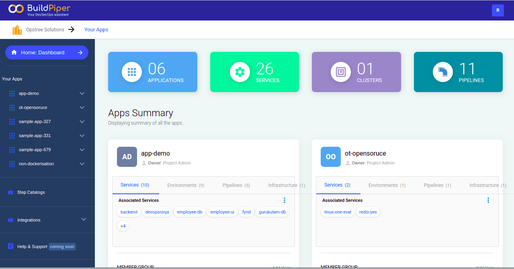
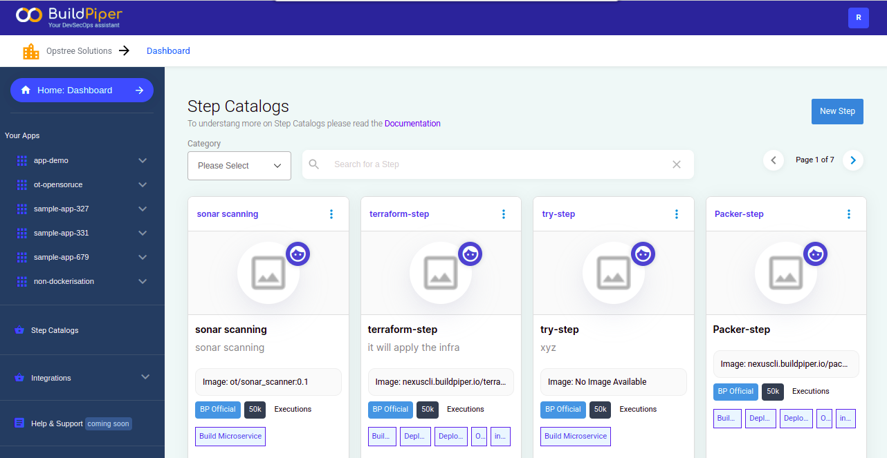
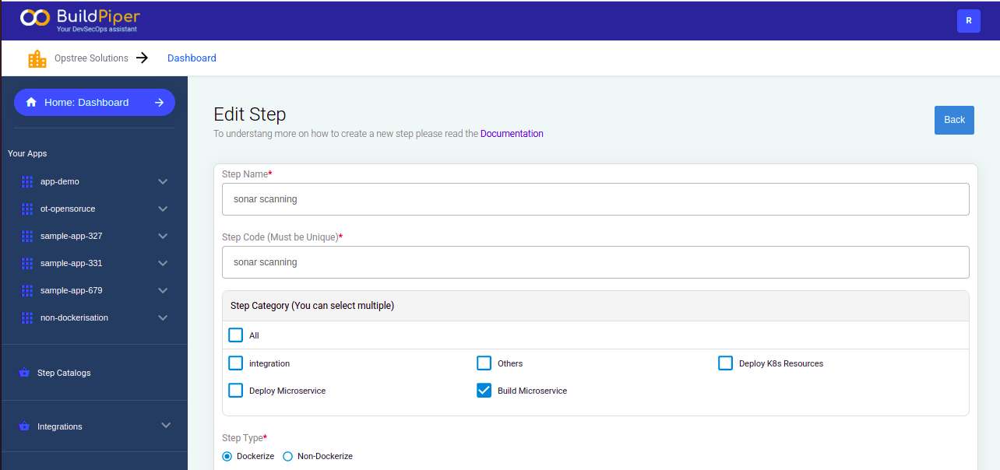
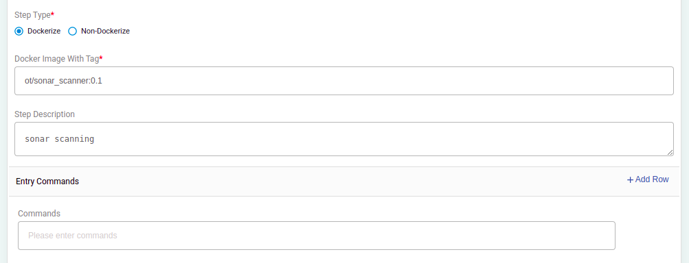
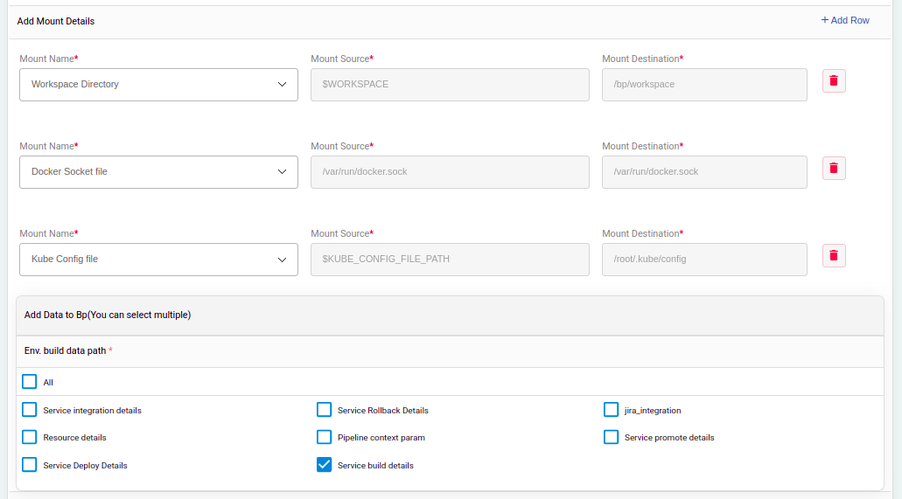
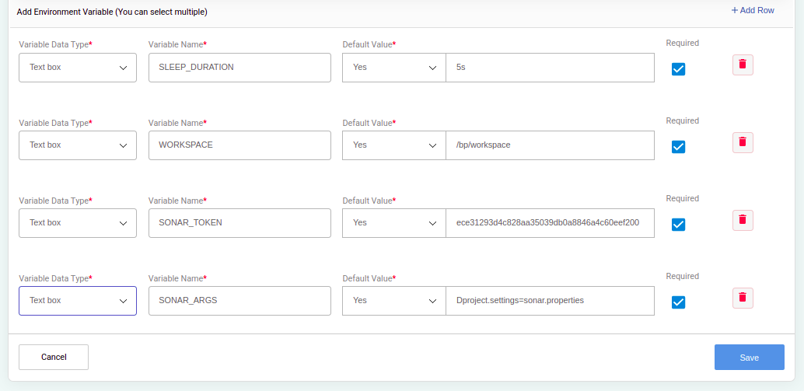

# BP-SONAR-SCANNER-STEP
A BP step to do sonar scanning

   * First of all, login to your Buildpiper server.
   
   * Click on the `Step Catalogs` option.

   

   * Then click on the `New Step` option.

   

   * Now entry the `Step Name` and `Step Code`.
   
   * Select the `Step Category`

   

   * Select the `Step Type` 

   

   * Add the `Add Mount Details` select the `Mount Name` from the drop down.
   
   * Now select the `Env. build data path`.

   

   * Add the `Environment Variable`.

   

   ```
   Note :- SONAR_ARGS (Optional) it's default value is Dproject.settings=sonar.properties
   ```
   
   * After providing the requried fields now click on the `Save` option

   * And save the `Step`.

## Setup
* Clone the code available at [BP-SONAR-SCANNER-STEP](https://github.com/OT-BUILDPIPER-MARKETPLACE/BP-SONAR-SCANNER-STEP)
* Build the docker image
```
git submodule init
git submodule update
docker build -t ot/sonar_scanner:0.1 .
```
* Do local testing

If you want to test sonar scanner CLI
```
sonar-scanner -Dsonar.login=<token> -Dsonar.host.url=https://sonarcloud.io/ -Dsonar.projectKey=<project-key> -Dsonar.organization=<org-key> -Dsonar.java.binaries=target
```

If you want to pass all arguments at runtime
```
docker run -it --rm -v $PWD:/src -e WORKSPACE=/ -e CODEBASE_DIR=src ot/sonar_scanner:0.1 " -Dsonar.login=<token> -Dsonar.host.url=https://sonarcloud.io/ -Dsonar.projectKey=<project-key> -Dsonar.organization=<org-key> -Dsonar.java.binaries=target"
```

Preferred one
```
docker run -it --rm -v $PWD:/src -e WORKSPACE=/ -e CODEBASE_DIR=src ot/sonar_scanner:0.1 " -Dsonar.login=<token> -Dproject.settings=sonar.properties"
```
## Reference
* https://docs.sonarqube.org/latest/analysis/scan/sonarscanner/